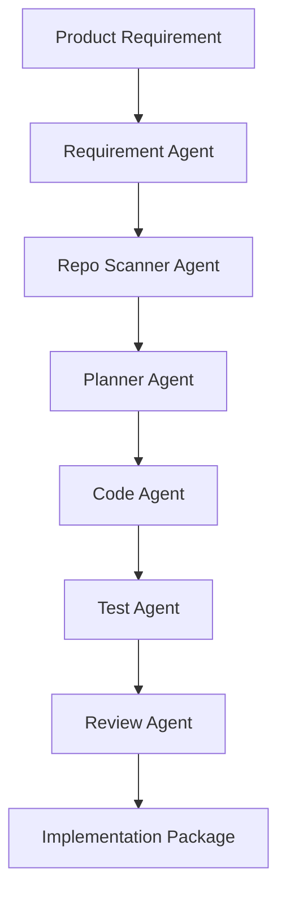

# Agentic Software Delivery

A multi-agent engineering workflow that converts product requirements into repository-aware implementation plans, code patches, test plans, and review reports.

This project is an MVP for an **AI-driven software delivery pipeline**. Instead of using an LLM as a one-shot code generator, it decomposes the software delivery process into specialized agents that collaborate across requirement understanding, repository analysis, implementation planning, patch generation, test design, and automated review.

---

## Why this project exists

Modern software delivery has a persistent gap between **product requirements** and **verified code changes**.

In a typical engineering workflow, a requirement has to pass through multiple lossy stages:

1. Product requirements are often ambiguous or incomplete.
2. Engineers manually interpret business intent and edge cases.
3. Developers search the repository to understand the existing architecture.
4. Implementation plans are often informal and not consistently reviewed.
5. Tests are written late, inconsistently, or skipped under time pressure.
6. Code review depends heavily on human attention and reviewer availability.

This creates avoidable problems:

- High communication cost between product, engineering, and QA.
- Repeated rework caused by misunderstood requirements.
- Poor traceability from requirement to implementation.
- Inconsistent test coverage.
- Review bottlenecks in fast-moving teams.
- Weak reuse of repository context and historical engineering knowledge.

This project turns that process into an **agentic software delivery pipeline**: a structured, traceable, multi-step workflow that helps move from natural language requirements to implementation-ready code changes.

---

## Core idea

The system uses multiple agents, each responsible for a specific engineering task.

Rather than asking one model to “write some code,” the workflow separates the problem into smaller reasoning stages:



The final output includes:

- Structured requirement analysis
- Repository scan summary
- Implementation plan
- Candidate code patch / unified diff
- Test plan
- Review report
- Risk assessment

---

## Core pain point solved

The project solves the problem of turning vague or semi-structured requirements into a more reliable engineering execution plan.

The core pain point is not simply “generating code.” The real problem is that software delivery requires a long chain of reasoning:

- What does the requirement actually mean?
- What are the acceptance criteria?
- Which parts of the repository are relevant?
- What files may need to change?
- What implementation path is least risky?
- What tests are needed to verify correctness?
- What risks should be reviewed before merging?

A single prompt is usually too shallow for this process. This project models software delivery as a **multi-agent, long-context, multi-step reasoning workflow**.

---

## Multi-agent workflow

### 1. Requirement Agent

The Requirement Agent converts a natural language requirement into a structured engineering brief.

It extracts:

- User intent
- Core business goal
- Acceptance criteria
- Constraints
- Edge cases
- Ambiguities
- Risk areas

Example input:

```text
Add a /health endpoint that returns {"status": "ok"} and explain how to test it.
```

Example output:

```text
Goal:
- Add a health check endpoint for service availability verification.

Acceptance criteria:
- The application exposes GET /health.
- The endpoint returns HTTP 200.
- The response body includes {"status": "ok"}.

Potential ambiguity:
- Authentication requirements are not specified.
- Response format conventions should follow the existing application style.
```

---

### 2. Repo Scanner Agent

The Repo Scanner Agent scans the local repository and builds a bounded context package for downstream agents.

It collects:

- File tree
- Source file summaries
- Relevant code snippets
- Framework hints
- Candidate entry points
- Test directory structure

This step prevents the system from generating code blindly. The code generation process becomes repository-aware.

---

### 3. Planner Agent

The Planner Agent performs repository-aware implementation reasoning.

It identifies:

- Candidate files to modify
- Required implementation steps
- Dependency impact
- Test targets
- Potential risks
- Rollback considerations

This is the main long-chain reasoning stage. The Planner Agent bridges the gap between product intent and engineering execution.

---

### 4. Code Agent

The Code Agent generates a candidate implementation patch.

The MVP supports outputting implementation changes in a `unified diff`-style format so that the result can be inspected before being applied.

The goal is not to blindly mutate the repository. The goal is to create a reviewable code change proposal.

---

### 5. Test Agent

The Test Agent proposes a verification strategy for the generated change.

It may include:

- Unit tests
- API tests
- Regression tests
- Edge-case tests
- Manual verification steps

This makes the workflow closer to real engineering delivery, where implementation without verification is incomplete.

---

### 6. Review Agent

The Review Agent reviews the generated plan and patch from multiple dimensions:

- Correctness
- Maintainability
- Security
- Performance
- Compatibility
- Test coverage
- Alignment with acceptance criteria

This creates a second-pass quality gate before a human engineer reviews the final result.

---

## What the MVP can do

Current capabilities:

- Run a local multi-agent software delivery workflow.
- Analyze a natural language software requirement.
- Scan a local code repository.
- Generate a structured implementation plan.
- Generate a candidate code patch or patch proposal.
- Generate a test plan.
- Generate an automated review report.
- Run through both CLI and FastAPI interfaces.
- Operate in mock mode when no LLM API key is configured.

---

## What this project is not

This MVP is not intended to be a fully autonomous production coding system.

It does not claim to:

- Replace engineers.
- Guarantee production-ready code.
- Automatically merge pull requests.
- Execute arbitrary code in a hardened sandbox.
- Fully understand every large-scale enterprise repository.

The intended use case is to demonstrate a structured, agentic engineering workflow that can be extended into a production-grade software delivery assistant.

---

## Project structure

```text
agentic-software-delivery/
├── ai_delivery_agent/
│   ├── agents/
│   │   ├── requirement_agent.py
│   │   ├── repo_scanner_agent.py
│   │   ├── planner_agent.py
│   │   ├── code_agent.py
│   │   ├── test_agent.py
│   │   └── review_agent.py
│   ├── cli.py
│   ├── config.py
│   ├── llm.py
│   ├── main.py
│   ├── models.py
│   └── orchestrator.py
├── sample_repo/
├── tests/
├── Makefile
├── pyproject.toml
├── README.md
└── .gitignore
```

---

## Quick start

### 1. Clone the repository

```bash
git clone https://github.com/EricAIHub/agentic-software-delivery.git
cd agentic-software-delivery
```

### 2. Create a virtual environment

macOS / Linux:

```bash
python -m venv .venv
source .venv/bin/activate
```

Windows PowerShell:

```powershell
python -m venv .venv
.venv\Scripts\Activate.ps1
```

### 3. Install dependencies

```bash
python -m pip install -e ".[dev]"
```

### 4. Optional: configure environment variables

If you want to connect the workflow to an LLM provider, create a `.env` file:

```bash
cp .env.example .env
```

Then add your API key:

```text
OPENAI_API_KEY=your_api_key_here
```

If no API key is configured, the project can still run in mock mode for local demonstration.

---

## Run with CLI

Example:

```bash
python -m ai_delivery_agent.cli \
  --repo ./sample_repo \
  --requirement "Add a /health endpoint that returns {'status':'ok'} and explain how to test it." \
  --output ./.agent_runs/sample
```

Expected output:

```text
.agent_runs/sample/
├── requirement_analysis.md
├── repo_scan.md
├── implementation_plan.md
├── patch.diff
├── test_plan.md
└── review_report.md
```

---

## Run with FastAPI

Start the API server:

```bash
uvicorn ai_delivery_agent.main:app --reload --host 0.0.0.0 --port 8000
```

Send a request:

```bash
curl -X POST http://localhost:8000/run \
  -H "Content-Type: application/json" \
  -d '{
    "repo_path": "./sample_repo",
    "requirement": "Add a /health endpoint that returns status ok.",
    "max_files": 20,
    "dry_run": true
  }'
```

Example response shape:

```json
{
  "requirement_analysis": "...",
  "repo_scan": "...",
  "implementation_plan": "...",
  "patch": "...",
  "test_plan": "...",
  "review_report": "..."
}
```

---

## Example use case

Input requirement:

```text
Add a /health endpoint that returns {"status": "ok"}.
```

The system will:

1. Parse the requirement and define acceptance criteria.
2. Scan the target repository.
3. Identify likely application entry points.
4. Propose an implementation plan.
5. Generate a candidate patch.
6. Propose tests for the endpoint.
7. Review the generated change for risks and completeness.

---

## Why multi-agent instead of one prompt?

A single prompt tends to mix too many responsibilities:

- Requirement analysis
- Repository understanding
- Planning
- Coding
- Testing
- Reviewing

That usually creates shallow outputs and missed edge cases.

This project separates those responsibilities into dedicated agents. Each agent produces an intermediate artifact that can be inspected, modified, or reused by later stages.

This makes the system more transparent and more aligned with real engineering workflows.

---

## Long-chain reasoning design

The project is designed around a long-chain reasoning process:

```text
Requirement
  → structured engineering brief
  → repository context
  → implementation reasoning
  → candidate code change
  → verification strategy
  → review and risk assessment
```

This structure is useful for tasks that require more than simple code completion.

The workflow consumes more context than a normal chatbot interaction because the system needs to reason over:

- Requirement intent
- Existing repository structure
- Cross-file relationships
- Implementation alternatives
- Test coverage
- Review risks

That is why this project is better suited for high-context LLM usage and larger token budgets.

---

## Testing

Run the test suite:

```bash
pytest
```

Or use the Makefile:

```bash
make test
```

---

## Development commands

Format code:

```bash
make format
```

Run lint checks:

```bash
make lint
```

Run tests:

```bash
make test
```

---

## Current limitations

This is an MVP, so several production capabilities are intentionally simplified.

Current limitations include:

- No hardened sandbox for executing generated code.
- No direct GitHub Pull Request creation yet.
- No CI/CD integration yet.
- No automatic multi-round test failure repair yet.
- Limited repository-scale indexing.
- Mock mode is used when no LLM API key is provided.

---

## Roadmap

Planned improvements:

- GitHub / GitLab Pull Request integration
- CI test execution and failure-log feedback
- Multi-round automatic repair loop
- Repository embedding index for larger codebases
- Safer sandboxed test execution
- Code ownership and reviewer recommendation
- Architecture-aware impact analysis
- Security scanning integration
- PR summary generation
- Human approval workflow

---

## Evaluation ideas

Possible evaluation dimensions:

| Dimension | Description |
|---|---|
| Requirement accuracy | Whether the system correctly extracts user intent and acceptance criteria |
| Repository awareness | Whether the implementation plan references relevant files and architecture |
| Patch quality | Whether generated changes are minimal, readable, and consistent |
| Test coverage | Whether proposed tests cover normal and edge cases |
| Review usefulness | Whether the review report catches meaningful risks |
| Delivery efficiency | Whether the workflow reduces manual planning and review time |

---

## Example project positioning

This project can be described as:

> A multi-agent software delivery MVP that automates the path from product requirements to repository-aware implementation plans, candidate code patches, test plans, and review reports.

Or more formally:

> An agentic software engineering workflow that models software delivery as a long-chain reasoning process across requirement understanding, repository analysis, implementation planning, code generation, test design, and automated review.

---

## License

No license has been specified yet. Add a license before using this project in a public or commercial setting.
